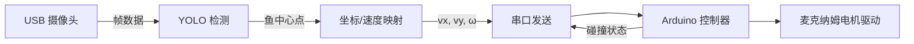

# 系统概览

本项目实现流程：

1. **图像采集**：Raspberry Pi 5 通过 USB 摄像头获取 20×30 cm 鱼缸的俯视画面。
2. **目标检测**：使用 YOLO (`best.pt`) 模型检测小鱼位置。
3. **坐标映射**：将像素坐标归一化并转换为麦克纳姆小车运动向量。
4. **运动控制**：通过串口向 Arduino 发送速度指令，驱动四轮麦克纳姆底盘。
5. **防撞保护**：Arduino 读取四面微动开关，检测碰撞后限制对应方向运动。

## 关键模块

- `raspi/src/camera.py`：摄像头采集与图像预处理。
- `raspi/src/detector.py`：YOLO 推理及多目标处理。
- `raspi/src/motion_mapping.py`：将归一化位置映射为麦克纳姆底盘速度。
- `raspi/src/serial_comm.py`：串口协议与指令发送（`V <vx> <vy> <omega>` 文本协议）。
- `raspi/src/safety.py`：与 Arduino 防撞状态交互，处理失联与心跳。
- `arduino/fishcar.ino`：解析速度向量、控制电机输出、处理微动开关。

## 数据流

## 运行环境

- Raspberry Pi OS (64-bit)
- Python 3.11 虚拟环境，依赖见 `raspi/requirements.txt`
- Arduino UNO/Nano（或兼容板）
- 电机驱动模块（如 L298N、MC33926），支持四轮独立控制

更多细节参考 `docs/setup_guide.md`。

